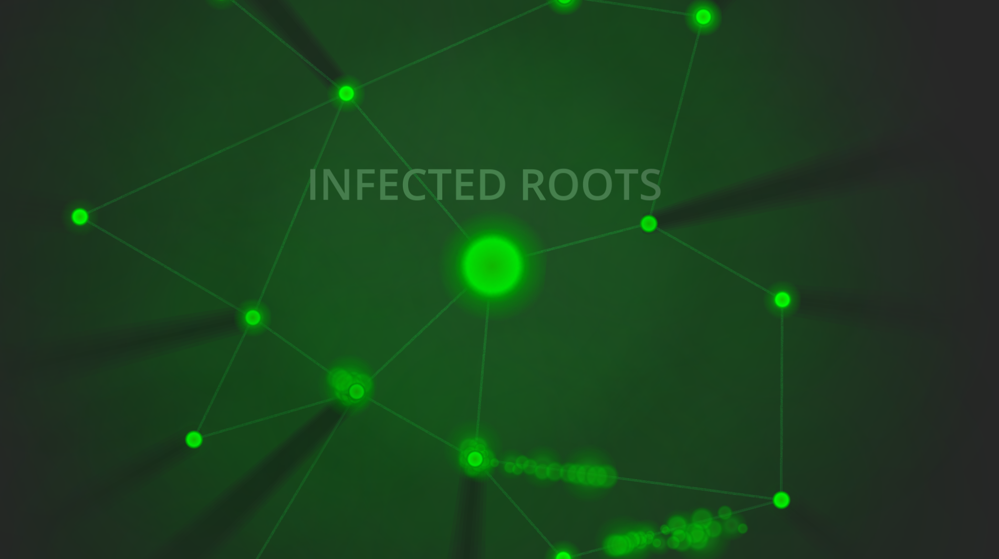

# Infected Roots

Infect the whole graph network, and fight the root node.

After all nodes has been infected, the root node can be infected.
But the root node will start sending out agents to restore the nodes. Infect all nodes around an agent to kill it.

Steer your infected agent with mouse, and move by clicking any mouse button. No other inputs required.

Made with Godot Engine v4.

## Download

- Linux/X11: <https://github.com/jilleJr/ggj-2023-roots/releases/download/v0.1.0/linux.zip>
- Windows: <https://github.com/jilleJr/ggj-2023-roots/releases/download/v0.1.0/windows.zip>

## Other links

- ItchIO: <https://jillejr.itch.io/infected-roots>
- GlobalGameJam: <https://globalgamejam.org/2023/games/infected-root-0>

## Credits

Kalle Fagerberg
